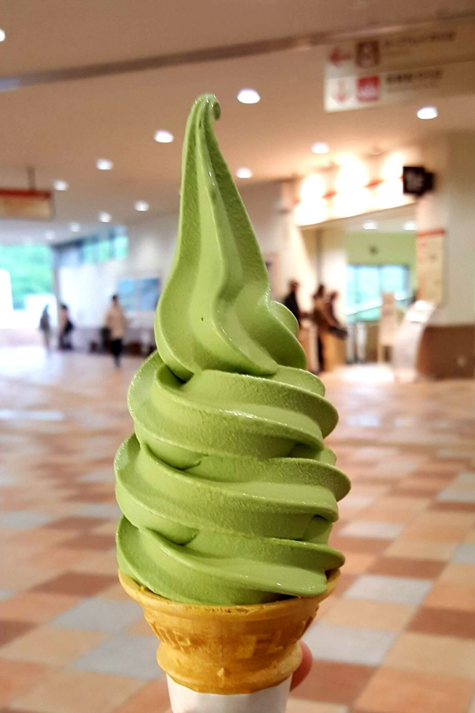
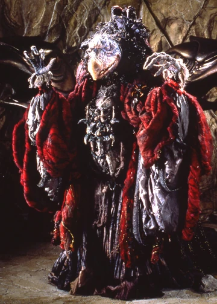
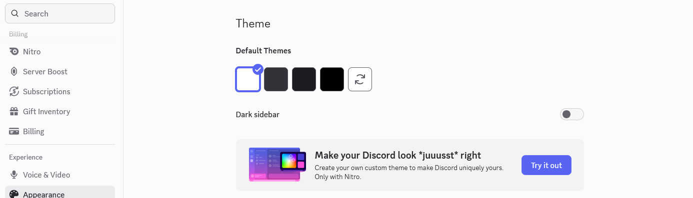

# me-in-markdown

Dear Mr. Aiello,

 Hello, my name is Calixto and I'm currently a student in the 10th grade. I currently have a pretty occupied life, being invested in multible hobbies aswell as school and academic success. Doing well or adequetely in school has always felt important to me and something that I should strive to do because it will help me in life, yet my goals this year related to school are slightly different compared to goals that I've had in the past. In the past I had a much easier time with school as the workload was alot less and classes were easier so my main goal was to simply put in effort and I'd get results that I would be happy with. Yet now effort isn't enough, the increased work load, mental load, and most importantly the **immense sacrifice of my time** have made it so that I must take a much more careful and meticulioius approach to how I go about academics and my school life. This school year my goal is to have much more concentrated and intentional use of my time and energy. I will work on and polish my bility to budget my time agordingly, especially with the variable of my own energy and stamina in mind. Yes, one of the main reasons that I am focusing on this concept is to do better in school consistently and improve my habits as a person, but it's also because I'd like more time to live life and do things that I enjoy much more.

I have two main hobbies and endeavors that I've partaken in right now, one of them being my inclusion and participation in the school's band. I play the Clarinet right now and so far I've had a fun experience being apart of the group. Though I do practice a pretty fair amount every day and sacrifice alot to be proficient at my instrument and overall ability as a member in the band, I joined and continue to participate for the experience itself. I enjoy the experience of playing music, being apart of something as a group, and just generally having a fun time with people of a simlilar age and a similar common interest. Ontop of that general explanation, I specificaly like some of the people in the band and choose to surround myself with them, so being able to spend more time with them at practices and competitions is really cool.

As a person I have many interests and I casually partake in such as consuming media such as videos, movies, shows, or music, and that I take pretty seriously like band and school, but what I've grown to spend the most amount of time towards in recent years has to be playing and cometing in video games, mainly Super Smash Bros. Melee. Here is a list of what my top 5 most played games would probably look like:
1. Super Smash Bros. Melee
2. Animal Crossing New Horizons
3. Super Smash Bros. Ultimate
4. Street Fighter V: Champion Edition
5. Guilty Gear: Strive

Though there are some outliers that I like, I truly <u>**love**</u> playing fighting games. Something is just so satisfying to me about the concept of how something can both resemble a sport in mentality and excecution/preformance, but also show deep complexety, need for knowledge, and positional knowledge like a game like chess. My current love is the game Super Smash Bros. Melee which I've been going to tournaments for and pracicing for the past 2-3 years. I play the Ice Climbers and there is just something so **absolutely magical** about how the game functions, the pace of the game, the amount of skill expression, and the sheer freedom that the system provides. So far I haven't been globally or regionally ranked yet(SoCal is one of the strongest regions so it's hard to get ranked), but I've taken sets in tournament vs many regionally and globally ranked players along with a win against a top ten level player. Here is my page on a page on a data site for fighting games which displays some of my accievements and journey in the game so far: https://www.supermajor.gg/melee/player/SaltInYourEye?id=S4110509

From,
Calixto Murakawa

# [Click here for some songs that I've been listening to this summer!](https://music.apple.com/us/playlist/me-in-markdown/pl.u-8aAVXDVTvkkevb4)

